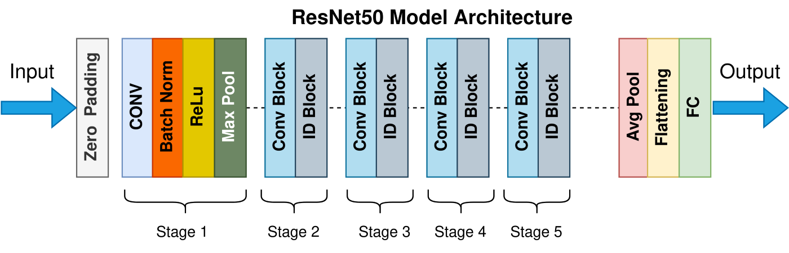

#  Fashion Recommender system 

The fashion industry is
a very dynamic and fast-changing environment. 
The fashion market is constantly changing, 
which makes it difficult for consumers to keep up
with the latest trends and styles. In order to help
people stay on top of the latest trends, an outfit 
recommendation system can be used by consumers to get 
recommendations about what they should wear based on 
their current style and preferences. An outfit
recommendation system can be used by both men and 
women to help them find new outfits that they will 
like based on their past purchases or other factors 
such as gender, age, location etc.

## Introduction

Recommendation systems are a very important part of the fashion industry. Fashion recommendation systems help users to find new products they might like, and can also be used for finding similar items.

Fashion recommender system is an artificial intelligence that analyzes user’s preferences and suggests them new products based on these preferences. This system can be used by both online stores and fashion brands to improve their sales.

## Background
Recommendation systems have been around for a long time. In the early days of e-commerce, companies used customer feedback to improve their products and services. However, with the advancement of technology, recommendation systems have become more sophisticated and effective in many ways.

In this era of social media, people are looking for recommendations from their friends on various platforms like Facebook, Twitter etc. This has led to an increase in the use of recommendation systems by businesses as well as consumers. The number of online shoppers has also increased due to which online retailers are using recommendation systems to convert more visitors into 
loyal customers

## Proposed Methodology

 The neural networks are initially trained, 
 after which a database is made for the objects 
 in the inventory and an inventory is chosen for the purpose of
 providing suggestions. Based on the supplied image, the nearest 
 neighbor's algorithm is utilised to locate the most pertinent products,
 and suggestions are provided.

 
## Training neural networks
The neural networks are trained using transfer learning from ResNet50 after the data has been pre-processed. In order to fine-tune the network model to address the current issue, more layers are included in the final layers that replace the architecture and weights from ResNet50. The ResNet50 architecture is depicted in the figure.

## Recommendation generation

Our recommended method makes use of Sklearn to produce recommendations. the closest neighbours. This enables us to locate the input image's closest neighbours. The Cosine Similarity measure is the similarity metric employed in this project. From the database, the top 5 recommendations are pulled, and their photos are shown.